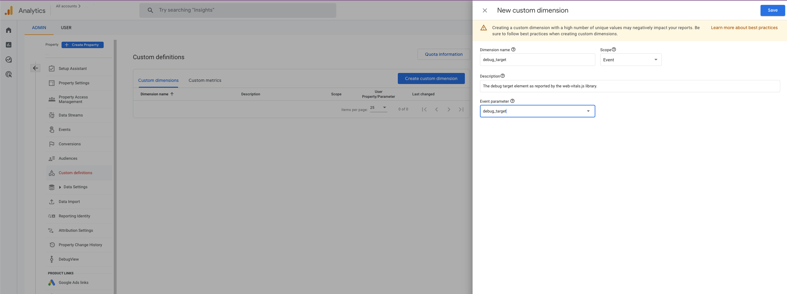

ReplayExperiences - Rex 🐕
=============================

> This project uses data from Google Analytics to replay user experiences and help debug INP values in the lab.

# Table of contents

- [web-vitals.js integration](#web-vitalsjs-integration)
  - [Send debugging data to Google Analytics](#send-debugging-data-to-google-analytics)
  - [Increased replay accuracy](#increased-replay-accuracy)
- [Configure Google Analytics properties](#configure-google-analytics-properties)
- [Run locally](#run-locally)

----

## web-vitals.js integration

This project uses a Google Account authentication flow to fetch all Google Analytics properties for the authenticated account.

In order to receive the full debugging experience of this tool, the website needs to report data via the [web-vitals.js library](https://github.com/GoogleChrome/web-vitals/) to a Google Analytics property.

### Send debugging data to Google Analytics

```js
import { onCLS, onFID, onLCP, onINP } from 'web-vitals/attribution';

function sendToGoogleAnalytics({ name, delta, value, id, attribution }) {
  const eventParams = {
    value: delta,
    // Custom params:
    metric_id: id, // Needed to aggregate events.
    metric_value: value,
    metric_delta: delta,
  };

  // More custom params per metric:
  switch (name) {
    case 'CLS':
      eventParams.debug_target = attribution.largestShiftTarget;
      break;
    case 'FID':
      eventParams.debug_target = attribution.eventTarget;
      break;
    case 'INP':
      eventParams.debug_target = attribution.eventTarget;
      // Need to use custom web-vitals build for `attribution.eventClientRects` support
      // https://github.com/charisTheo/web-vitals/blob/main/web-vitals.attribution.js
      // eventParams.debug_target_coordinates = attribution.eventClientRects;
      eventParams.debug_time = attribution.eventTime;
      eventParams.debug_type = attribution.eventType;
      eventParams.debug_load_state = attribution.loadState;
      break;
    case 'LCP':
      eventParams.debug_target = attribution.element;
      break;
    default:
  }

  gtag('event', name, eventParams);
}
```

> Reference and more details about how to [send data to Google Analytics with web-vitals.js](https://github.com/GoogleChrome/web-vitals/#send-the-results-to-google-analytics).

### Increased replay accuracy

For increased test accuracy when replaying user experiences, get and report coordinates of debug target with this [custom build of web-vitals/attribution module](https://github.com/charisTheo/web-vitals/blob/main/web-vitals.attribution.js).

After you have downloaded [this file](https://github.com/charisTheo/web-vitals/blob/main/web-vitals.attribution.js) and added to your project, update the Google Analytics reporting method like so:


```js
// Update import
import { onCLS, onFID, onLCP, onINP } from './src/web-vitals.attribution.js';

function sendToGoogleAnalytics({ name, delta, value, id, attribution }) {
  //...

    // Update custom event parameters for INP
    case 'INP':
      eventParams.debug_target_coordinates = attribution.eventClientRects;

  //...
  gtag('event', name, eventParams);
}
```

## Configure Google Analytics properties

In the example above you will create new custom dimensions, i.e. `metric_rating`, `debug_target`, etc. These custom dimensions will be tied to the Google Analytics events.

For these new custom dimensions to be used by Google Analytics, they need to be registered. This is done through the online admin page of each Google Analytics property, like in the screenshot below:



_Inside the Google Analytics Admin dashboard, select the property. Then under `Custom definitions` click 'Create custom dimension'_

Create a new custom dimension for each of the parameters listed below:

1. `debug_target`
2. `debug_target_coordinates` ([make sure you follow this](#increased-replay-accuracy))
3. `debug_time`
4. `debug_type`
5. `debug_load_state`

Make sure you match the new 'Dimension name' field to the names listed above.

> ❗️ It is important to give the _exact_ 'Dimension name' as specified in the list above!

You must match the 'Event parameter' to the name you have given your custom event params [here](#web-vitalsjs-integration).

----

## Run locally

1. Clone repository and navigate to it:

    ```
    git clone https://github.com/charisTheo/rex-demo.git && cd rex-demo
    ```

2. Initialise and install root dependencies:

    ```
    npm i && npm run init
    ```
    
3. Install front-end and server dependencies:

    ```
    cd front-end && npm i && cd ../server && npm i
    ```

4. Add secrets

    1. Create an `.env` file under `./server`

    2. Add [GCP OAuth client secrets](https://developers.google.com/identity/protocols/oauth2/web-server) for your project:

        ```
        client_id=<...>.apps.googleusercontent.com
        project_id=<...>
        auth_uri=https://accounts.google.com/o/oauth2/auth
        token_uri=https://oauth2.googleapis.com/token
        auth_provider_x509_cert_url=https://www.googleapis.com/oauth2/v1/certs
        client_secret=<...>
        redirect_uri=http://localhost:3000/api/googleapis/oauth2Callback
        backend_url=http://localhost:3000
        frontend_url=http://localhost:8080
        JWT_SECRET=<...>
        ```

5. Run in dev mode, from the root directory of the project:

    ```
    npm run dev
    ```